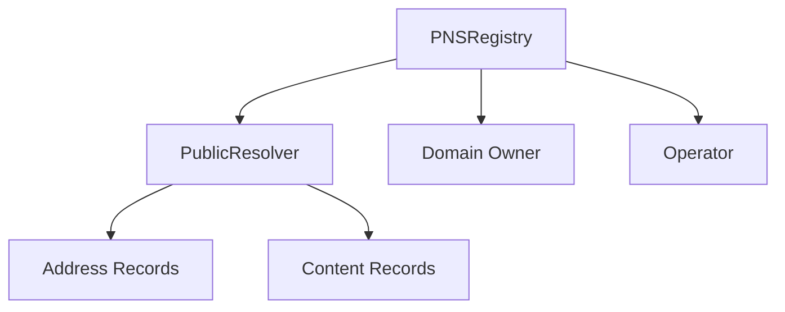
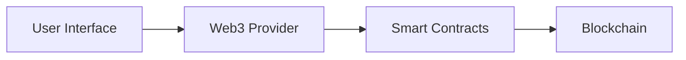

# PNS Architecture

## Overview

PNS (Polkadot Naming Service) is built with a modular architecture that separates concerns between the smart contracts and the frontend application. This document provides a detailed overview of the system's architecture.

## Smart Contract Architecture

### Core Components

#### 1. PNSRegistry Contract

The PNSRegistry is the central contract that manages the entire naming system. It maintains:

- Domain ownership records
- Subdomain hierarchies
- Resolver assignments
- TTL (Time To Live) settings
- Operator permissions

Key features:

- Hierarchical domain structure
- Permission management
- Event emission for important state changes
- Flexible resolver system

#### 2. PublicResolver Contract

The PublicResolver handles the resolution of names to various types of records:

- Address resolution
- Content hash management
- Interface support verification

### Contract Interactions

## Frontend Architecture

### Technology Stack

- **Framework**: Next.js 14
- **Language**: TypeScript
- **Styling**: Tailwind CSS
- **State Management**: React Query
- **Web3 Integration**: RainbowKit, Wagmi

### Key Components

1. **Providers**
   - Web3 provider configuration
   - Chain configuration
   - Theme setup

2. **Pages**
   - Home page
   - Domain registration
   - Domain management
   - Profile pages

3. **Components**
   - UI components
   - Web3 integration components
   - Form components

### Data Flow

## Security Considerations

### Smart Contract Security

1. **Access Control**
   - Owner-only functions
   - Operator permissions
   - Role-based access control

2. **Input Validation**
   - Name format validation
   - Address validation
   - Parameter bounds checking

3. **State Management**
   - Atomic operations
   - State consistency checks
   - Event emission for tracking

### Frontend Security

1. **Web3 Security**
   - Secure wallet connection
   - Transaction signing
   - Chain validation

2. **Data Security**
   - Environment variable protection
   - API key management
   - Secure storage

## Performance Considerations

### Smart Contract Optimization

1. **Gas Optimization**
   - Efficient storage usage
   - Optimized function calls
   - Batch operations where possible

2. **State Management**
   - Minimal state changes
   - Efficient event emission
   - Optimized data structures

### Frontend Optimization

1. **Performance**
   - Code splitting
   - Lazy loading
   - Image optimization

2. **User Experience**
   - Responsive design
   - Loading states
   - Error handling

## Testing Strategy

### Smart Contract Testing

1. **Unit Tests**
   - Function testing
   - State management
   - Access control

2. **Integration Tests**
   - Contract interactions
   - Event emission
   - State transitions

### Frontend Testing

1. **Unit Tests**
   - Component testing
   - Hook testing
   - Utility function testing

2. **Integration Tests**
   - Page testing
   - Web3 integration
   - User flows

3. **E2E Tests**
   - User journeys
   - Critical paths
   - Error scenarios
